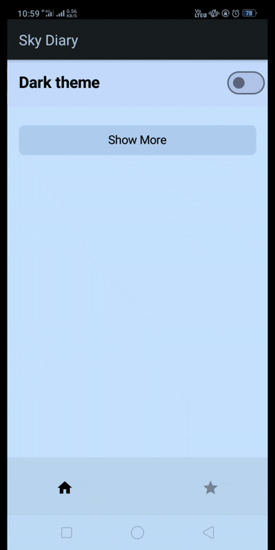

# 🚀 Sky Diary — NASA APOD Viewer  

*A simple, fast Android app to browse NASA’s Astronomy Picture of the Day (APOD) — save for offline, toggle theme, and enjoy a clean Jetpack Compose UI.*

---

## Badges
  
 

---

## ✨ Features
- 📸 Fetches NASA Astronomy Picture of the Day via Retrofit.  
- 🗂️ Save/remove images offline (Room DB) — saved state reflected in the list.  
- 🌗 Light / Dark theme toggle (Preference DataStore) — persisted across restarts.  
- ⚡ Smooth UI: shimmer loading, image crossfade, card animations.  
- 🧭 Two-tab nav: **Home** (grid) and **Offline** (saved).  
- 📊 Firebase Analytics for basic DAU tracking.

---

## 🚀 Install / Download
**Download the latest signed APK:**  

**Build from source (developer):**
1. `git clone https://github.com/Prashant-Sgh/APOD.git`  
2. Open in **Android Studio**.  
3. Add a `local.properties` at the **project root** with your API key: NASA_API_KEY=your_new_api_key_here (with no spaces around "=")
   > **Do not commit** `local.properties`.  
4. Build `./gradlew assembleDebug`  
5. The APK appears in: `app/build/outputs/apk/...`

---

## 🧭 Usage Guide (short)
- **Home Grid** — Two-column grid of APOD cards.  
- Tap a card → **Detail** (full image, title, date, explanation).  
- Top-right switch toggles Light/Dark theme.  
- “Show More” button at bottom loads older entries.  
- **Detail** — Favorite (save/unsave) via heart/star icon; UI shows saved state.  
- **Offline tab** — View saved images offline; open details or remove from offline.  
- **State** — saved status stored in Room; theme stored in DataStore.

---

## 🧰 Tech stack
- Language: **Kotlin**  
- UI: **Jetpack Compose (Material3)**  
- Networking: **Retrofit + Gson**  
- Images: **Coil (2.5.0)**
  > In order to match minsdk 21+
- Local storage: **Room** (offline saved items) & **DataStore Preferences** (theme)  
- Concurrency: **Kotlin Coroutines / StateFlow**  
- Analytics: **Firebase Analytics** 
- Min SDK: **21** (Android 5.0+)

---

## 🤝 Contributing
Thanks — contributions welcome!  
1. Fork → create a feature branch.  
2. Keep secret out of commits (`local.properties` is ignored).  
3. Open a PR with a short description and screenshots/GIFs for UI changes.  
4. For major changes, open an issue first so we can discuss.

---

## Notes & tips
- ✅ Put `NASA_API_KEY` in `local.properties` (with no quotes).  

---

## 📡 Data Source & Attribution

This app uses data and images from NASA’s [Astronomy Picture of the Day (APOD) API](https://api.nasa.gov/).  
All image rights remain with their respective owners as credited by NASA on the APOD website.

> **Disclaimer:** This project is for educational and portfolio purposes only.  
> Images may be subject to copyright by third parties — please check credits on each APOD page before reuse.
